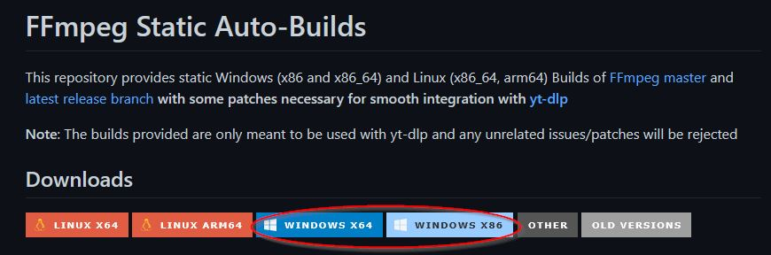
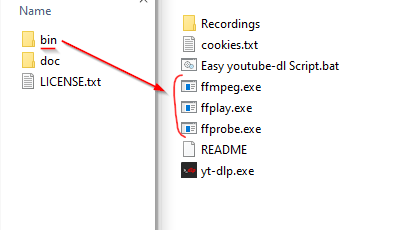
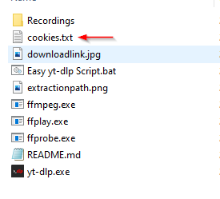

Script only works for Windows

# How to use

1. Top right corner green button Code > Download ZIP. Extract all contents in the same folder
2. Double click the Easy yt-dlp Script.bat
3. Paste the video URL and hit Enter
4. ???
5. The videos will be in the Recordings folder
6. Profit!

The script will work as is, but at a lower quality. **[Download ffmpeg](https://github.com/yt-dlp/FFmpeg-Builds#ffmpeg-static-auto-builds) to improve quality.**

Extract the contents inside ffmpeg-master-latest-winXX-gpl/bin into the same folder as yt-dlp.exe

# Paid Streams

To download paid streams on spwn, you will need the cookies.txt extension ([Chrome](https://chrome.google.com/webstore/detail/get-cookiestxt/bgaddhkoddajcdgocldbbfleckgcbcid) / [Firefox](https://addons.mozilla.org/en-US/firefox/addon/cookies-txt/))

Place and rename the cookies.txt file like this below. If cookies.txt already exist, delete and replace it with the new exported one

Then follow How to use above
